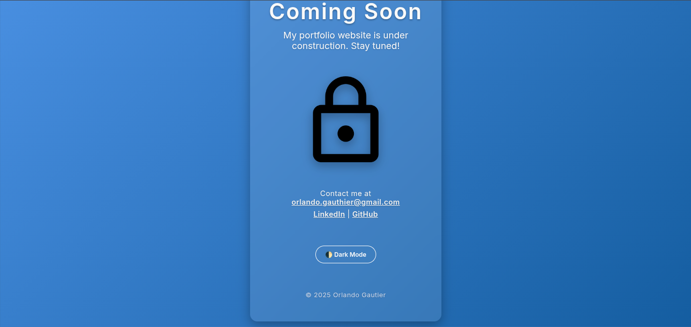

# 🚀 Coming Soon Landing Page

A responsive, animated, and SEO-friendly "Coming Soon" landing page built with HTML, CSS, and JavaScript.  
Includes a dark/light mode toggle, contact links, and mobile-first design.

📍 **Live Demo:** [View Here](https://orlandogautier.github.io/coming-soon)

---

## ✨ Features

- ✅ Fully responsive layout (mobile + desktop)
- 🌙 Dark/Light mode toggle with `localStorage` memory
- 🎨 CSS animations (`fadeIn`, `pulse`)
- 🧠 Semantic HTML for better SEO
- 📧 Contact section with email + social links
- ⚡️ Lightweight, fast, no frameworks

---

## 🛠 Technologies Used

- HTML5 (Semantic structure)
- CSS3 (Flexbox, animations, responsive design)
- JavaScript (Theme toggle, DOM manipulation)
- [Google Fonts](https://fonts.google.com/specimen/Inter) – Inter

---

## 📷 Preview

  

---

## 📁 How to Use

1. **Clone the repo**
   git clone https://github.com/orlandogautier/coming-soon.git
   cd coming-soon
2. Open in browser
   open index.html
3. Or deploy it using GitHub Pages.

🧑‍💻 Author
Orlando Gautier – @orlandogautier

https://linkedin.com/in/orlando-gautier-7011bb1a

📜 License
This project is licensed under the MIT License.